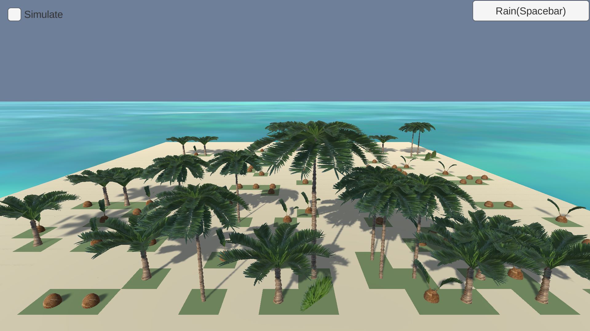

  

Emergence is a game design project based off of James Conway's Game of Life, one of the first computer simulations dealing with basic AI fuctioning.  Positioned on a desert island, players can plant coconuts to bring the island to life.  The rules of the simulation follow closely with Conway's orginial parameters.  The longer the coconut tree survives the larger it grows. 

The coding challenges for this class project included basic AI programming, learning two-dimensional arrays and lists.  

For this project, I created all of the 3D palm tree models and applied distinct textures to each using the software program Blender.

The game has a basic movement control system.  Left Mouse Click to plant coconuts, Keyboard arrows to move, and mouse scroll wheel to zoom in.  Click the button below to play.    

Click to play [Emergence](http://ryseymour.github.io/treeproto/).

