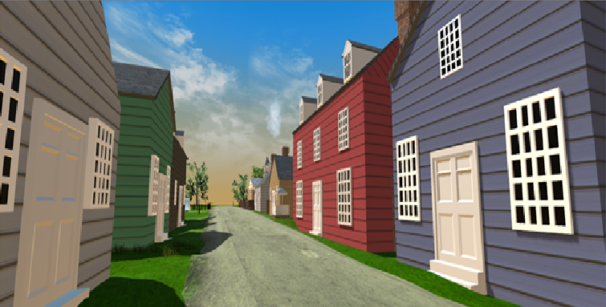

  
  

The Virtual Reality Tour of Williamsburg was a game design project I worked on during the summer of 2017.  The project had me reconstruct historical buildings in a 3D modeling software called Blender.  The textures on the buildings result from photographs I had taken during a visit to Williamsburg and then added to my custom made 3D models.  

The challenges of learning 3D modeling were frequent and hard to navigate.  One of the most difficult problems was exporting models from the 3D modeling software Blender to Unity.  

