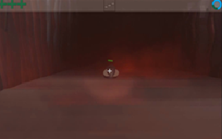

  
  

Toxicity is a horror themed First Person Shooter where the player must shrink down to microscopic sizes to aid a patient's immune system with destroying deadly forms of bacteria. 

This was my final project for my first Game Development course.  It featured a healthbar, timer, two weapons to choose from and a heavy reliance on a flashlight in a dark environment.  Enemy behaviors were also varied for this game.  Some could follow the player and duplicate their numbers.  Others could act as turrets and shoot poisonous globs at the player.  

