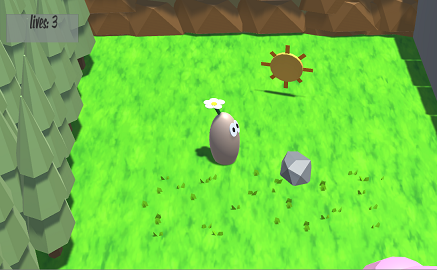
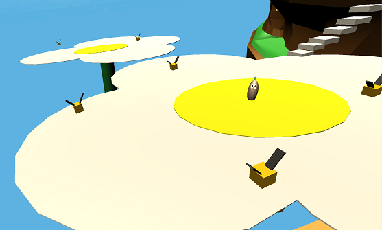

  
  

Tater was one of my first Unity projects.  The project was focused around getting a character to have realistic physics in a game space.  Since it's a platformer the focus of the challenges in the game involve messing with in-game gravity.  In the second level I added a trampoline effect to some really large flower pedals.  In level 3, there are dropping platforms that initate based on a collision from the player.  

